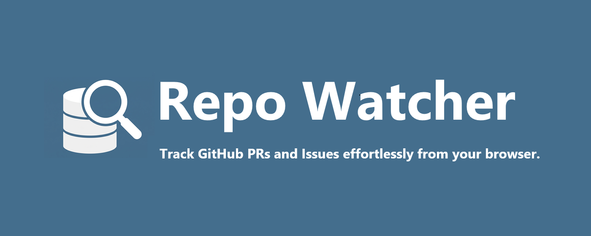
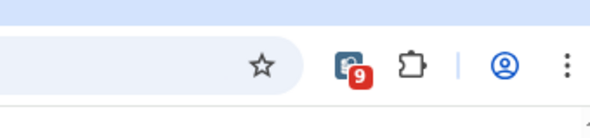
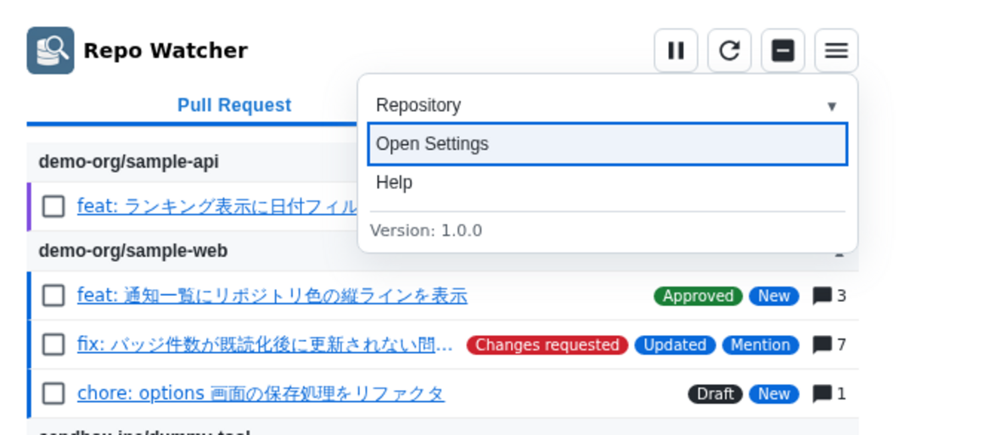
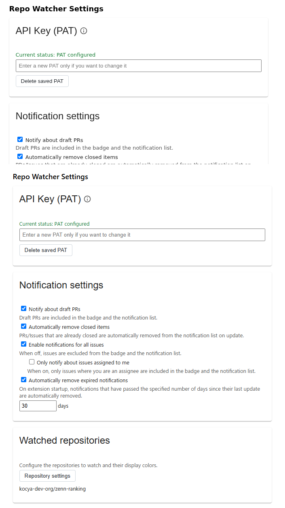
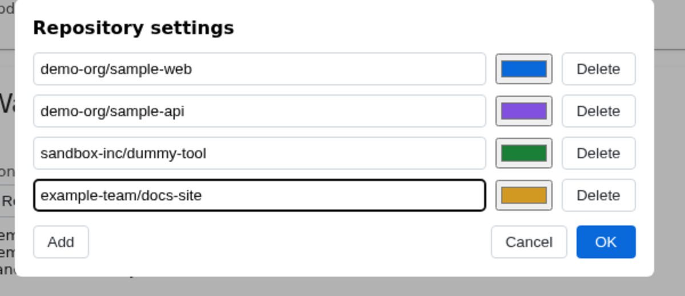
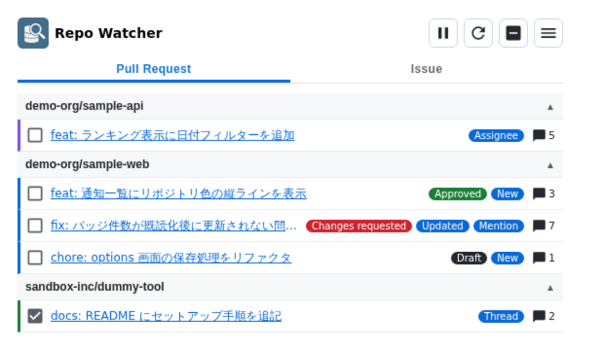
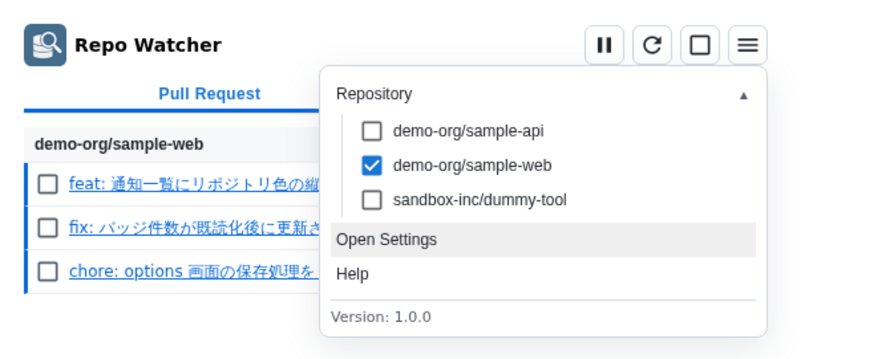

# Repo Watcher Manual

## What this extension does

Repo Watcher is a Chrome extension that monitors Issues and Pull Requests in configured GitHub repositories.

It primarily detects the following notifications:

- New Issue / Pull Request
- Mentions of you
- New comments on Issues / Pull Requests where you are the assignee

Notifications are shown via the extension icon badge and in the popup window.

## Prerequisites

- Chrome or a Chromium-based browser
- GitHub Personal Access Token (PAT)
- The owner/repository names of the repositories you want to watch

A fine-grained PAT is recommended. You can create a PAT in GitHub's `Settings` > `Developer Settings`. Required permissions:

- Metadata: Read-only
- Issues: Read-only
- Pull requests: Read-only
- Pull requests: Read-only

## Initial setup

After loading the extension, open the settings page.

How to open:

- Click the extension icon
- Open the popup menu in the top-right
- Select "Open Settings"

### API Key (PAT)

1.  Enter your GitHub PAT in the "API Key (PAT)" field.
2.  Press "Save".

The PAT is encrypted and stored in the extension's local storage.

### Notification settings

The following two settings are available:

- "Notify about draft PRs": Draft PRs are included in the badge and the notification list when enabled.
- "Automatically remove closed items": PRs/Issues that are already closed are automatically removed from the notification list on update when enabled.

### Watched repositories

1.  Click "Repository settings".
2.  Add repositories to watch using the owner/repository format.
3.  Optionally set a display color for each repository.
4.  Click "OK".
5.  Finally, press "Save" on the settings page.

The chosen display color is shown as a left stripe on each notification in the popup.

### Watch interval

Specify the notification detection interval in minutes. The minimum is 15 minutes.

### Last checked

The "Last checked" field shows the most recent time the notifications were fetched.

Press "Reset" to clear the stored time. The next update will re-fetch notifications using 00:00:00 of the current day as the baseline.

## Viewing notifications

In the popup you can switch between Pull Request and Issue tabs.

Each notification shows the following information:

- Title: The PR/Issue title; selecting it opens the corresponding page on GitHub.
- Notification kind label: Shows status such as a mention or update.
- Repository color: The configured color is displayed as a stripe at the left of the notification.
- Comment count: The number of comments; selecting it opens the latest comment on GitHub ("Open latest comment").
- Read / Unread state: Mark items read to exclude them from the list on the next popup open.

Notification kind labels and their meanings:

- New: Item created since the last check
- Updated: Existing item with updates
- Mention: A mention of you was detected
- Thread: New comment on an unresolved review thread that previously mentioned you
- Assignee: You are the assignee and a new comment was posted
- Approved: PR has a review approval
- Changes requested: PR has a changes requested review
- Draft: Draft PR

## Icon menu

### Pause and resume periodic watching

Press the pause button in the popup's top-right to stop periodic watching. Press again to resume.

Manual refresh via the update button is still available while paused.

### Manual refresh

Press the refresh button in the popup's top-right to run the watch cycle immediately.

### Toggle read/unread

- Use the left button on each notification to toggle Read / Unread.
- Use the check button in the top-right to mark all items in the current view as read or unread.

Read items are excluded from the unread count.

Items marked read remain visible while the popup is open; reopening the popup will remove them from the list.

### Menu

- Open "Repository" from the popup menu to filter the view by configured repositories.
- Open "Options" to go to the settings page.
- View version information.

## Troubleshooting: notifications not appearing

Check the following in order:

1.  Is a PAT configured?
2.  Does the PAT have the required permissions?
3.  Are the watched repositories configured correctly?
4.  Is periodic watching paused?
5.  Is the watch interval set too long?
6.  Does a manual refresh produce an error?

Reset the "Last checked" time and run a manual refresh to re-check using 00:00:00 of the current day as the baseline.

## Notes

- The notification list is managed around unread items; read notifications are not retained.
- Whether draft PRs are shown depends on the "Notify about draft PRs" setting.
- Remember to press "Save" after changing settings for them to take effect.
