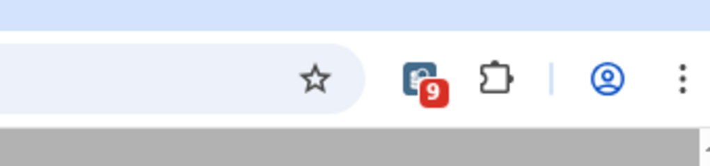
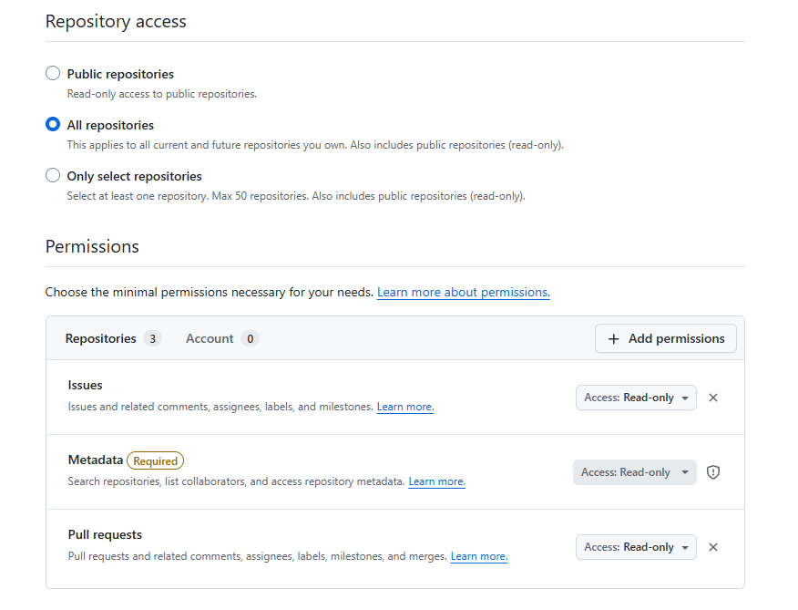
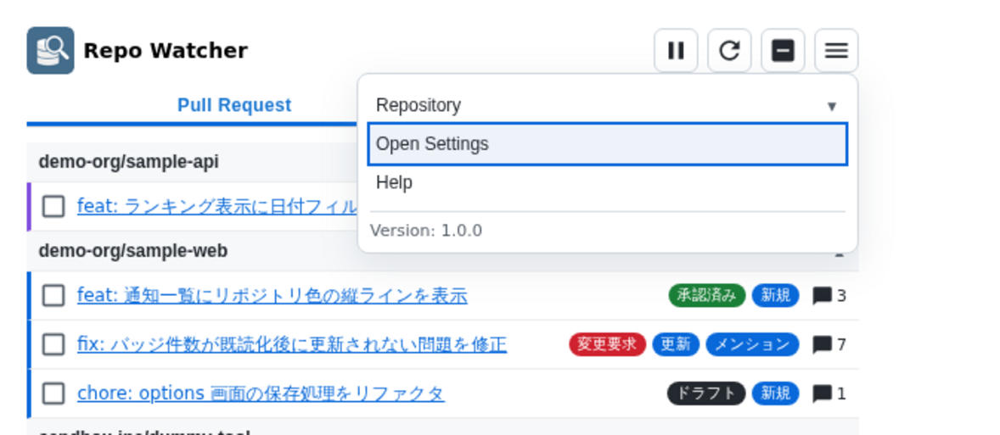
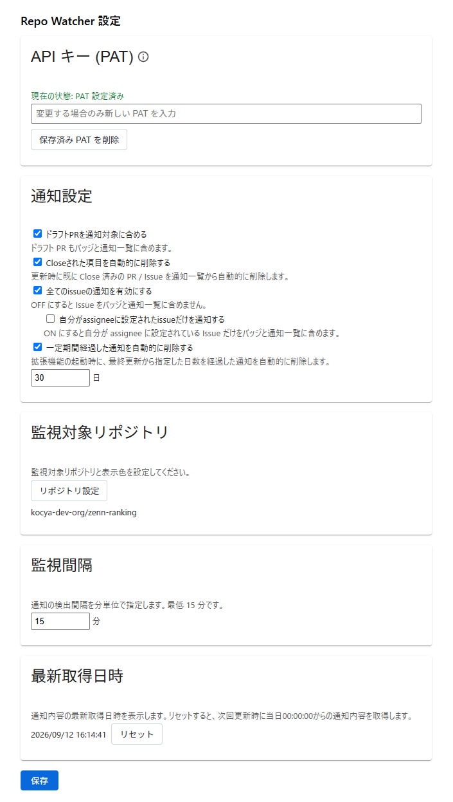
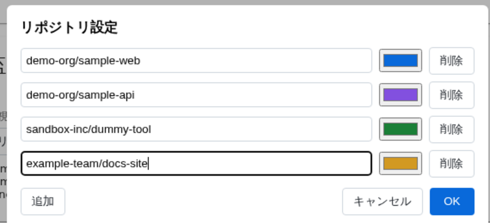
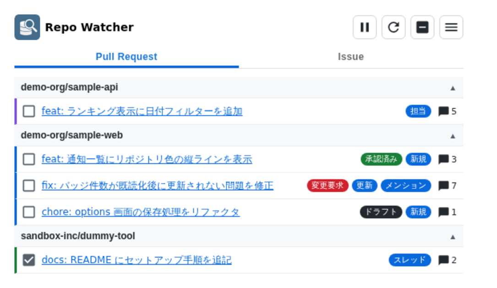
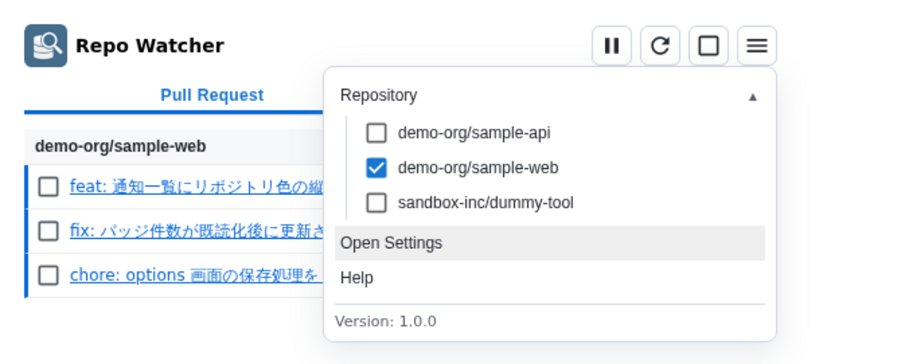

# Repo Watcher マニュアル

## この拡張機能でできること

Repo Watcher は、指定した GitHub リポジトリの Issue と Pull Request を監視する Chrome 拡張です。

主に次の通知を確認できます。

- 新しい Issue / Pull Request
- 自分へのメンション
- 自分が担当者の Issue / Pull Request への新しいコメント

通知は拡張アイコンのバッジ、ポップアップ画面で確認できます。

## 事前に用意するもの

- Chrome または Chromium 系ブラウザ
- GitHub Personal Access Token (PAT)
- 監視したいリポジトリの owner/repository 名

PAT は GitHubの`Settings` > `Developer Settings`より作成してください。 (fine-grained PAT を推奨します。)  
`All repositories`や`Only select repositories`を選択する場合、必要な権限は次のとおりです。

- Metadata: Read-only
- Issues: Read-only
- Pull requests: Read-only

## 初期設定

拡張機能を読み込んだら、まず設定画面を開きます。

開き方:

- 拡張アイコンをクリックする
- ポップアップ右上のメニューを開く
- Open Settings を選ぶ

### API キー (PAT)

1. API キー (PAT) 欄に GitHub PAT を入力します。
2. 保存 を押します。

PAT は拡張機能の local storage に暗号化して保存されます。

### 通知設定

設定できる項目は次の 2 つです。

- ドラフトPRを通知対象に含める
  ON にすると、ドラフト PR もバッジと通知一覧に含まれます。
- Closeされた項目を自動的に削除する  
  ON にすると、更新時にすでに Close 済みの PR / Issue を通知一覧から削除します。

### 監視対象リポジトリ

1. リポジトリ設定 を押します。
2. 監視したいリポジトリを owner/repository 形式で追加します。
3. 必要に応じて表示色を設定します。
4. OK を押します。
5. 最後に設定画面で 保存 を押します。

表示色はポップアップ内の通知左端のライン色として使われます。

### 監視間隔

監視間隔 は分単位で設定します。最小値は 15 分です。

### 最終チェック日

最終チェック日 には、最後に監視した日時が表示されます。

リセット を押すと保存済みの時刻を消します。次回の監視では、当日の 0:00 を基準に再取得します。

## 通知の見方

ポップアップでは通知を Pull Request と Issue のタブで切り替えられます。

各通知では主に次の情報を確認できます。

- タイトル: PR / Issue のタイトルです。選択すると GitHub 上の該当ページを開きます
- 通知種別ラベル: PR / Issue の状態や自分へのメンションなどを示すラベルです
- リポジトリ色: 設定済みリポジトリの表示色が通知左端に表示されます
- コメント数: PR / Issue のコメント数です。選択すると GitHub 上の最新コメントの該当ページを開きます
- 既読 / 未読の状態: チェックしてポップアップ画面を閉じると、次回ポップアップ画面では一覧から除外されます

通知種別ラベルの意味:

- 新規: 前回チェック後に作成された項目
- 更新: 既存項目に更新があった項目
- メンション: 自分へのメンションを検出した項目
- スレッド: 自分への過去メンションを含む未解決レビュー スレッドに新しいコメントが付いた項目
- 担当: 自分が担当者で、新しいコメントが付いた項目
- ドラフト: ドラフト PR
- 承認済み: レビュー承認済みの PR
- 変更要求: 変更要求が付いている PR

## アイコンメニュー

### 定期監視の一時停止と再開

ポップアップ右上の一時停止ボタンを押すと定期監視を止められます。再度押すと再開します。

一時停止中でも、更新ボタンによる手動更新は実行できます。

### 手動更新

ポップアップ右上の更新ボタンを押すと、その場で監視処理を実行できます。

### 既読と未読の切り替え

- 各通知の左側ボタンで既読 / 未読を切り替えます。
- 右上のチェックボタンで、現在表示中の一覧をまとめて既読または未読にできます。

既読にした通知は未読件数から除外されます。

ポップアップを開いている間は既読のまま表示されます。ポップアップを開き直すと一覧から除外されます。

### メニュー

- ポップアップ右上のメニューから Repository を開くと、設定済みリポジトリ単位で表示を絞り込めます。
- オプションを開くと、設定画面に移動できます。
- バージョン情報が確認できます。

## 通知が来ないときの確認項目

次を順に確認してください。

1. PAT が設定済みか
2. PAT に必要な権限があるか
3. 監視対象リポジトリが正しく設定されているか
4. 定期監視が一時停止になっていないか
5. 監視間隔が長すぎないか
6. 手動更新でエラーが出ないか

最終チェック日 をリセットしてから手動更新すると、当日 0:00 以降の更新を基準に再確認できます。

## 補足

- 通知一覧は未読中心で管理されます。既読にした通知は保持されません。
- ドラフト PR の表示有無は 通知設定 の内容に従います。
- 設定変更後は 保存 を押さないと反映されません。
